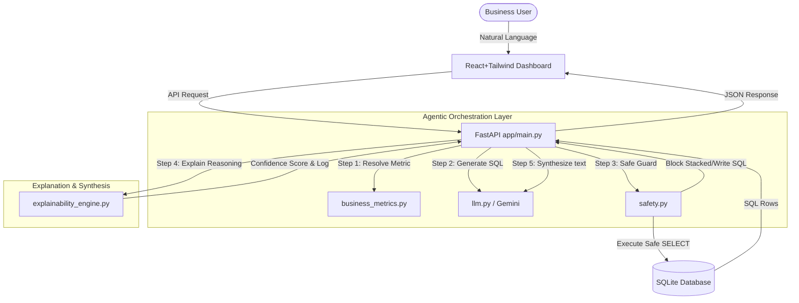

# Upgraded Technical Design Document - BevInsight AI Copilot

This document specifies the updated architecture, validation modules, and forecasting algorithms of the **BevInsight AI Copilot v2** system.

---

## 1. Upgraded Agentic Workflow Architecture

BevInsight v2 converts a standard text-to-SQL pipeline into a multi-step agentic orchestrator:

---

## 2. Advanced Component Designs

### A. SQL Safety Validator (`app/safety.py`)
Intercepts the generated SQL from the LLM before execution:
- Parses the query syntax to confirm it begins with `SELECT` or `WITH`.
- Blocks multi-query stacking separated by semicolons (e.g. `SELECT...; DROP...`).
- Applies regex keyword tokenizers to detect and intercept destructive operations: `DROP`, `DELETE`, `UPDATE`, `INSERT`, `ALTER`, `TRUNCATE`, `ATTACH`, `PRAGMA`.

### B. Business Metric Resolution (`app/business_metrics.py`)
Leverages a static metadata dictionary representing beverage metrics (Revenue, Volume, Promo Uplift, WoW Growth, Stockout Risk, Excess Inventory) and token synonym matches. It extracts intent strings to boost accuracy.

### C. Explainability & Confidence Engine (`app/explainability_engine.py`)
Computes query-correctness confidence scores using a heuristic weight allocation:
- Safe Compilation & Validation: **40%**
- Semantic Metric Resolution Match: **30%**
- Database ResultSet payload count > 0: **20%**
- Specific Parameter Detection (e.g. regional names): **10%**

### D. Decision Simulator (`app/scenario_engine.py`)
Models marketing and inventory parameters using standard price elasticity of demand (PED) ratios:
- **Promo Elasticity:** Assumes a 1.0% increase in promotional discount yields a 2.5% increase in quantity sold, balanced against price dilution ($1 - Discount$).
- **Inventory Safety Stock Cushion:** Assumes a 10% increase in stock levels recovers 1.5% of sales volume previously lost to stockouts.
- **Aggregated Risk Score:** Computes a score (1 to 10) based on stockout probability averages, discount depth, and demand drops.

---

## 3. Printable Board Report Design
- Integrates a print layout utilizing `@media print` CSS configurations.
- When `Generate Board Report` is triggered, the browser hides all interactive elements, chat boxes, and control panels, formatting the board memo on structured white pages with clean grids and dark-gray text for professional PDF archiving.
